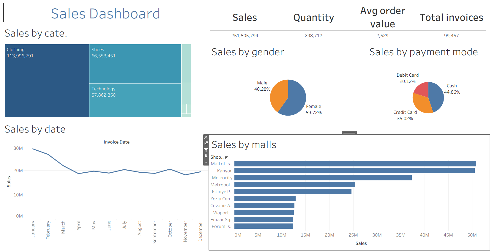

# 📊 Sales Data Dashboard | Tableau

> An interactive **Sales Data Analytics Dashboard built with Tableau** to analyze sales performance, customer purchasing behavior, product categories, shopping mall performance, and transaction trends.


---

## 📌 Project Overview

The **Sales Data Dashboard** is an interactive business intelligence project developed using **Tableau**.

The project transforms a customer shopping transaction dataset into an interactive dashboard that helps analyze:

- Overall sales performance
- Product category performance
- Shopping mall performance
- Customer demographics
- Purchase quantity
- Payment methods
- Sales trends over time
- Transaction volume
- Average Order Value

The dashboard is designed to make large amounts of transactional data easier to understand through **KPIs, charts, comparisons, filters, and interactive visualizations**.

---

## 🎯 Project Objectives

The primary objectives of this project are to:

1. Analyze sales performance using transactional data.
2. Identify high-performing product categories.
3. Compare sales performance across shopping malls.
4. Understand customer purchasing patterns.
5. Analyze sales trends over time.
6. Evaluate different payment methods.
7. Create meaningful business KPIs.
8. Build an interactive and easy-to-understand Tableau dashboard.
9. Convert raw transactional data into actionable business insights.
10. Demonstrate practical data visualization and business intelligence skills.

---

## 🖼️ Dashboard Preview

The repository contains a screenshot of the completed Tableau dashboard.

> **Dashboard Screenshot**




---

## 📊 Dashboard Highlights

The dashboard provides an interactive view of sales data through multiple analytical perspectives.

### 💰 Sales Performance

Analyze overall sales generated from customer transactions and compare performance across different dimensions.

### 🏬 Shopping Mall Analysis

Compare sales performance across different shopping malls to identify locations with stronger transaction activity and revenue contribution.

### 📦 Category Analysis

Analyze product categories to determine which categories contribute more significantly to overall sales.

### 📅 Sales Trend Analysis

Use transaction dates to understand how sales performance changes over time and identify periods with higher or lower activity.

### 👥 Customer Analysis

Explore customer characteristics and purchasing behavior using attributes such as:

- Customer ID
- Gender
- Age
- Quantity purchased
- Product category

### 💳 Payment Method Analysis

Analyze the distribution of transactions across available payment methods and understand customer payment preferences.

### 🔎 Interactive Analysis

Tableau filters and dashboard interactions allow users to explore the data from different perspectives instead of relying only on static charts.

---

# 📈 Key Performance Indicators

The Tableau workbook contains calculated metrics that support sales analysis.

## Total Sales

Sales are calculated using:

```text
Sales = Price × Quantity
```

This metric represents the total value generated from individual transactions.

## Average Order Value

Average Order Value can be used to understand the average value of each transaction:

```text
Average Order Value =
Total Sales / Number of Invoices
```

## Transaction Volume

The dashboard also enables analysis of transaction/invoice volume to understand purchasing activity.

## Quantity Sold

Quantity provides an additional perspective on product demand and purchasing behavior.

---

# 🗂️ Dataset

The project uses the **Customer Shopping Dataset** stored in:

```text
customer_shopping_data.csv
```

The dataset contains transaction-level customer shopping information.

### Dataset Attributes

| Column | Description |
|---|---|
| `invoice_no` | Unique invoice/transaction identifier |
| `customer_id` | Unique customer identifier |
| `gender` | Customer gender |
| `age` | Customer age |
| `category` | Product category |
| `quantity` | Number of items purchased |
| `price` | Price of the purchased item |
| `payment_method` | Payment method used for the transaction |
| `invoice_date` | Date of the transaction |
| `shopping_mall` | Shopping mall where the transaction occurred |

---

# 🔄 Data Analysis Workflow

```text
                Raw Dataset
                     │
                     ▼
        Customer Shopping Data
                     │
                     ▼
              Tableau Import
                     │
                     ▼
          Data Exploration
                     │
                     ▼
        Calculated Fields / KPIs
                     │
                     ▼
           Data Visualization
                     │
                     ▼
        Interactive Dashboard
                     │
                     ▼
          Business Insights
```

---

# 🛠️ Tools & Technologies

| Technology | Purpose |
|---|---|
| **Tableau** | Dashboard development and data visualization |
| **CSV** | Source transactional dataset |
| **Tableau Calculated Fields** | KPI and metric calculations |
| **Tableau Extract** | Data processing and dashboard performance |
| **GitHub** | Project hosting and version control |

---

# 📂 Project Structure

```text
Sales-data-dashboard/
│
├── Sales data.twb
│   └── Tableau workbook
│
├── customer_shopping_data.csv
│   └── Source sales/customer transaction dataset
│
├── dashboard.png
│   └── Dashboard screenshot
│
└── README.md
    └── Project documentation
```

---

# 🚀 How to Run the Project

## Prerequisites

To explore the dashboard locally, you need:

- **Tableau Desktop**
- Git
- The repository files

---

## 1. Clone the Repository

```bash
git clone https://github.com/shivam11191/Sales-data-dashboard.git
```

Navigate into the project directory:

```bash
cd Sales-data-dashboard
```

---

## 2. Open the Tableau Workbook

Open:

```text
Sales data.twb
```

using Tableau Desktop.

---

## 3. Verify the Data Source

The workbook uses:

```text
customer_shopping_data.csv
```

If Tableau cannot locate the CSV after cloning the repository, reconnect the workbook to the CSV file located in the project directory.

---

## 4. Explore the Dashboard

Once the workbook is loaded, use the available:

- Filters
- Charts
- KPI cards
- Category selections
- Mall selections
- Date-based analysis
- Interactive dashboard actions

to explore the dataset.

---

# 🔍 Business Questions

This dashboard can be used to answer questions such as:

### Sales

- What is the overall sales performance?
- How does sales performance change over time?
- Which locations generate higher sales?

### Product Categories

- Which product categories perform best?
- Which categories contribute significantly to sales?
- How does purchase quantity differ between categories?

### Shopping Malls

- Which shopping malls generate the highest sales?
- Which malls have greater transaction activity?
- How does sales performance vary by location?

### Customers

- How does purchasing behavior vary by age?
- How does purchasing behavior differ by gender?
- What categories are purchased most frequently?

### Payments

- Which payment methods are most frequently used?
- How does payment behavior vary across transactions?

---

# 💡 Key Data Analytics Concepts Demonstrated

This project demonstrates practical application of several data analytics and business intelligence concepts:

- Data exploration
- Descriptive analytics
- KPI development
- Sales analysis
- Customer analysis
- Category analysis
- Time-series analysis
- Data visualization
- Interactive dashboards
- Business intelligence
- Data storytelling
- Calculated fields
- Dashboard filtering
- Business-oriented reporting

---

# 📊 Dashboard Design Approach

The dashboard is designed around the idea of moving from **high-level performance to detailed analysis**.

### Level 1 — Overview

KPIs provide a quick understanding of overall performance.

### Level 2 — Performance Analysis

Charts allow comparison across:

- Shopping malls
- Product categories
- Dates
- Payment methods

### Level 3 — Interactive Exploration

Filters and dashboard interactions allow users to investigate specific segments of the dataset.

This structure makes the dashboard useful for both quick reporting and deeper exploratory analysis.

---

# 📁 Repository Files

## `Sales data.twb`

The Tableau workbook containing the dashboard configuration and analysis.

It includes the Tableau visualizations, calculated fields, worksheets, dashboard layout, filters, and related workbook configuration.

## `customer_shopping_data.csv`

The underlying customer shopping transaction dataset used for the analysis.

## `dashboard.png`

A visual preview of the completed dashboard.

---

# 🔮 Future Improvements

The project can be extended with additional analytics features such as:

- 📈 Sales forecasting
- 📊 Year-over-year growth analysis
- 📅 Month-over-month growth
- 👥 Customer segmentation
- 🏆 Top-performing products/categories
- 📍 Geographic analysis
- 🔁 Customer retention analysis
- 💰 Profitability analysis
- 📉 Advanced trend analysis
- 🎯 Target vs. actual performance
- 📱 Improved dashboard responsiveness
- 🌐 Tableau Public deployment

---

# 📚 What I Learned

Through this project, I strengthened my practical understanding of:

- Connecting datasets to Tableau
- Exploring transactional data
- Creating calculated fields
- Designing business KPIs
- Building interactive visualizations
- Using filters and dashboard actions
- Presenting data through visual storytelling
- Converting raw data into meaningful business insights
- Designing dashboards with business users in mind

---

# 💼 Portfolio Value

This project demonstrates hands-on experience in:

**Data Analysis → Data Visualization → Business Intelligence → Dashboard Development → Business Insights**

It can be used as a portfolio project to demonstrate practical skills for roles such as:

- Data Analyst
- Business Analyst
- BI Analyst
- Reporting Analyst
- Junior Data Analyst
- Tableau Developer

---

# 👨‍💻 Author

## Shivam Prakash

**MCA Student | Data Analyst | Frontend Developer | Software Engineer**

I'm interested in building data-driven solutions, interactive dashboards, and applications that transform raw information into useful insights.

### Connect With Me

- **GitHub:** [@shivam11191](https://github.com/shivam11191)
- **LinkedIn:** [Shivam Prakash](https://www.linkedin.com/in/shivampr1709/)
- **Portfolio:** [shivam11191.github.io/portfolio](https://shivam11191.github.io/portfolio/)

---

# ⭐ Support

If you found this project useful or interesting, consider giving the repository a ⭐.

It helps support the project and motivates me to build more data analytics projects.

---

# 📄 License

This project is created for **educational, portfolio, and data analytics demonstration purposes**.

---

## 🔗 Repository

**GitHub:**  
https://github.com/shivam11191/Sales-data-dashboard
